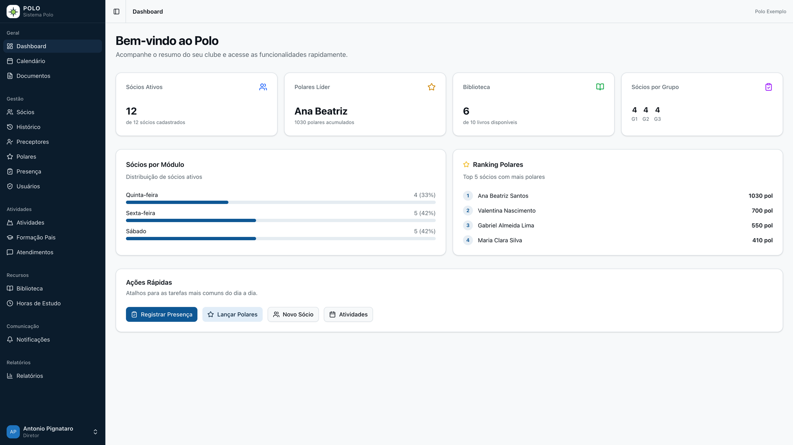
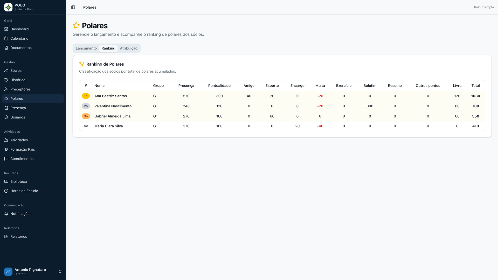
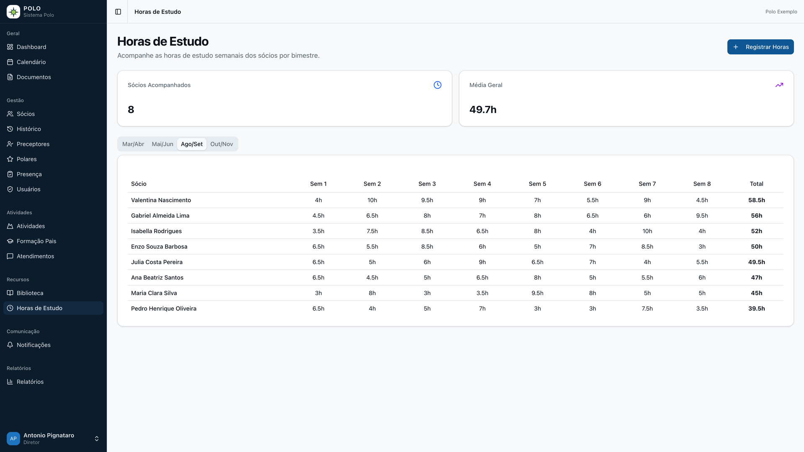
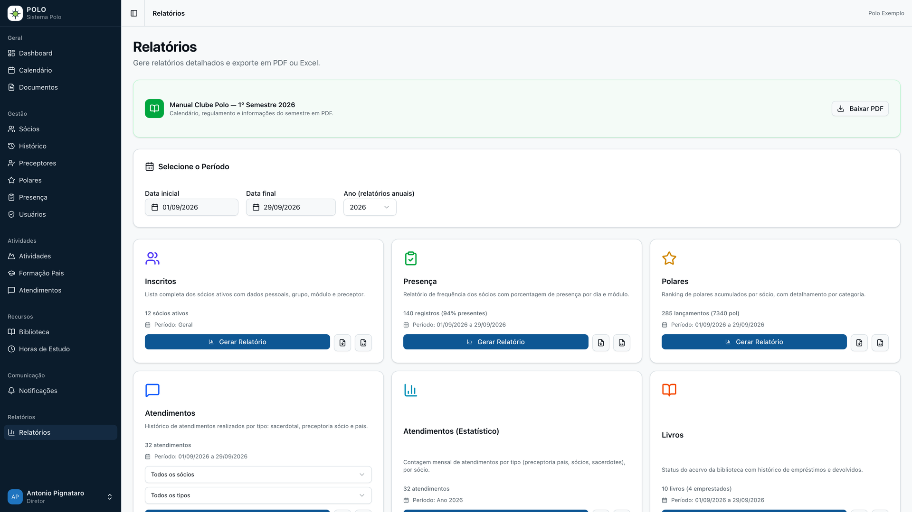
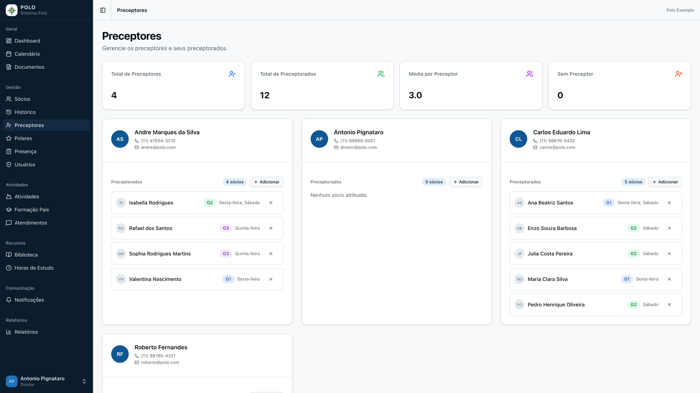
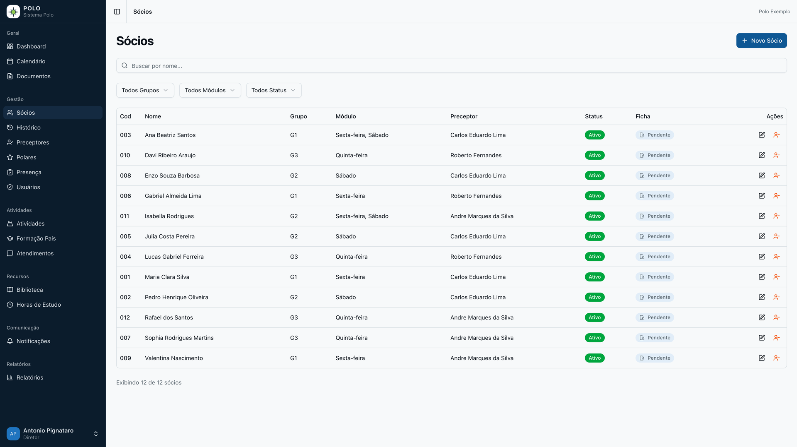
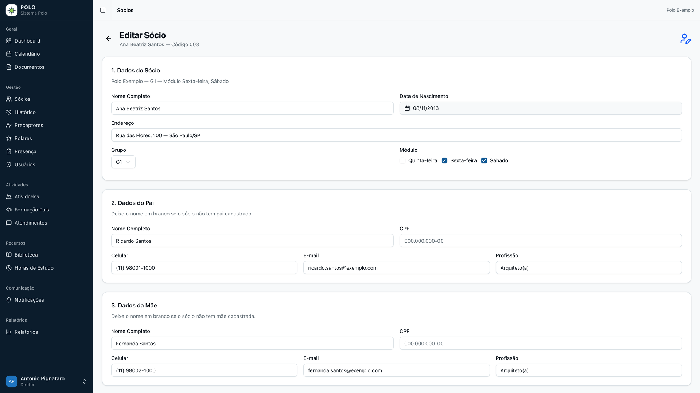
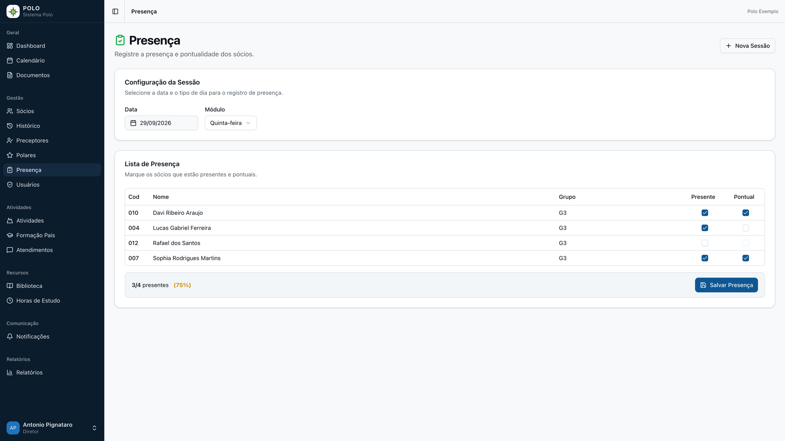
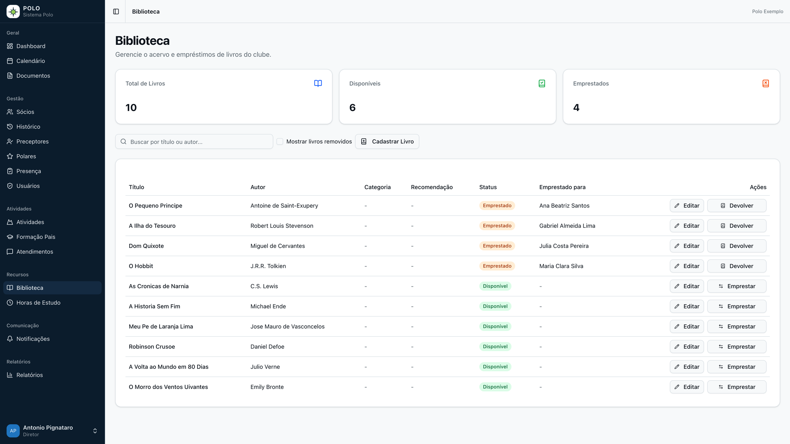
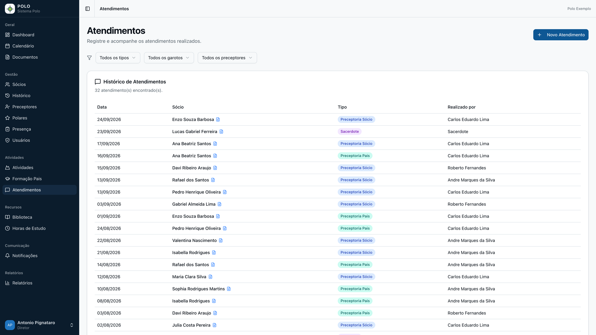

# Polo — Club Management CRM/ERP

Multi-tenant SaaS for youth clubs: members and their parents, mentors, attendance, a gamified points system, library, activities, study hours and reports. Built solo for a real client and developed end-to-end with AI coding agents (Claude Code).



<sub>The interface is in Brazilian Portuguese. All data in the screenshots is fictional.</sub>

## Highlights

- **Multi-tenant SaaS** — each club is an isolated tenant (shared tables scoped by `club_id`), resolved by subdomain.
- **Role-based access** — five roles (Super Admin, Director, Preceptor, Monitor, User). Parent features are unlocked by linking a parent record, so a director can also be a parent.
- **Parents' portal** — self-registration, automatic linking by e-mail, electronic signature of the enrollment term, study-hours logging and activity sign-ups for their children.
- **"Polares" points system** — 11 scoring categories, participation rules by age group, automatic points when a book is returned, and a yearly reset.
- **Reports** — 8 report types with preview and PDF/Excel export. Server-side PDFs are attached to automated e-mail alerts.
- **Automations** — 5 scheduled jobs: attendance and mentoring alerts, birthday digests, calendar reminders and the yearly reset.
- **Security** — CSP and HSTS headers, login rate limiting, Edge-safe JWT middleware and environment validation with Zod.
- **Mobile-ready** — every table switches to a card layout on phones, dialogs become bottom sheets, and the app is installable as a PWA.

## Screenshots

| Points ranking | Study hours |
|---|---|
|  |  |
| **Reports** | **Preceptors (mentors)** |
|  |  |

<details>
<summary>More screenshots</summary>

| Members | Member form |
|---|---|
|  |  |
| **Attendance** | **Library** |
|  |  |
| **Mentoring log** | |
|  | |

</details>

## Tech stack

Next.js 16 (App Router, Server Actions) · TypeScript · Prisma 7 · PostgreSQL (Supabase) · NextAuth.js v5 · Tailwind CSS v4 + shadcn/ui · Zod + react-hook-form · Resend · jsPDF · ExcelJS · Vercel (hosting and cron jobs)

## Architecture

- **Modular monolith** — 16 domain modules in `src/modules/` (members, polares, attendance, library, reports…), 25 pages and a 24-table Prisma schema.
- **Tenant isolation** — mutations go through Server Actions wrapped by auth helpers (`withAuth`, `withRole`, `getClubScope`) that scope every query to the user's club.
- **Stateless auth** — NextAuth.js with JWT sessions. The Edge middleware verifies tokens without touching the database.
- **Pluggable e-mail** — Resend behind a small abstraction, with a console fallback when it isn't configured.

## How it was built

I was the only developer, working directly with the client from the first requirements meeting to production support. The implementation was done with AI coding agents (Claude Code) under my direction:

- **Context engineering** — [`CLAUDE.md`](CLAUDE.md) is the project's source of truth: domain rules, architecture decisions and a session-by-session development log that every agent session starts from.
- **Orchestration** — subagents working in parallel on independent tasks, with MCP servers and Agent Skills integrated into the workflow.
- **My role** — gathering requirements with the client, making the architecture decisions and validating every delivery: testing each feature by hand, with additional checks run by the agents.

## Running locally

Requirements: Node.js 20+ and a PostgreSQL database (a free Supabase project works).

```bash
git clone https://github.com/AntonioPignataro/polo-crm.git
cd polo-crm
npm install
cp .env.example .env.local        # fill in DATABASE_URL, AUTH_SECRET and CRON_SECRET
npx prisma generate
DATABASE_URL="postgresql://...:5432/postgres" npx prisma migrate dev   # migrations use the session port (5432)
npm run db:seed                    # fictional test data
npm run dev
```

Open http://localhost:3000 and sign in with the seed account `diretor@polo.com` / `admin123`.

Deployment and operations notes (in Portuguese) are in [`docs/OPERATIONS.md`](docs/OPERATIONS.md).

---

Built by **Antonio Pignataro** · [LinkedIn](https://www.linkedin.com/in/antoniopignataro). Published with the client's permission.
